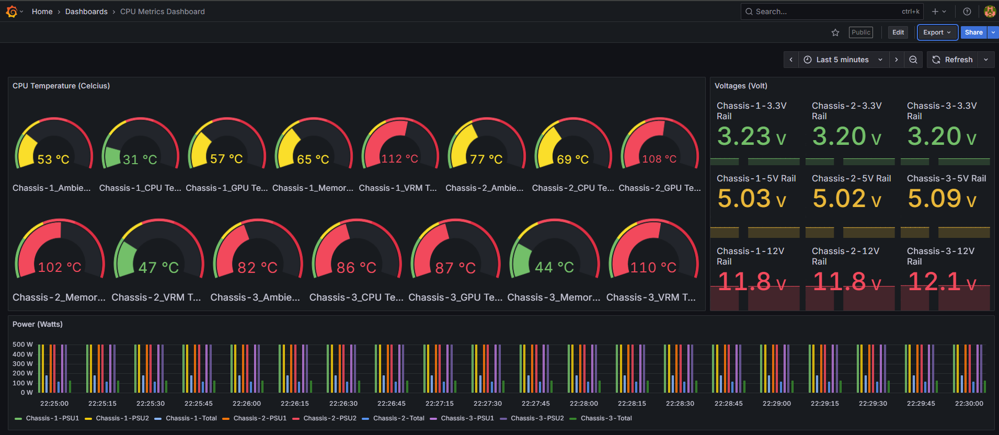

# Prometheus-Grafana Setup

Use the docker-compose.yaml file to deploy a docker based Prometheus and Grafana instance.

```cmd
docker-compose up -d
```

Once the setup is ready, prometheus will be available at `http://localhost:9090/` and grafana will be available at `http://localhost:3000/`.


### Sanity Check Promethues

Prometheus will scrape data every 5s from the `host.docker.internal:8000` endpoint, as configured in the `prometheus.yml` file. Feel free to modify as per your requirements. 

For local development, since the prometheus is inside a container, it cannot access data present at `http://localhost:8000`, thus, we used `prometheus.internal:8000`

Data will be scraped from `/metrics` endpoints, which is exposed by the `HardwareMonitor` microservice, so ensure that the API is reachable. 

Data Flow: 

LibreHardwareMonitor (Windows) -> Hardware Monitor (`/metric` endpoint) -> Prometheus (scraped every 5 secs) -> Grafana (Dashboard) -> Frontend (embedded iframe)

### Setting up Grafana

Sign-in to grafana using admin access

```
username: admin
password: admin
```

No need to update the password.

### Grafana Dashboard

Once inside grafana, click on `Dashboard->New Dashbord`

You will have an option to import an existing dashboard. Upload the `Prometheus-Grafana/CPU Metrics Dashboard-1753384407041.json` file here.

A dashboard will be created, but it has no data yet. We must connect prometheus to grafana.

#### Connecting Prometheus to Grafana

Since your docker composed deployed both prometheus and grafana, grafana can access prometheus as `http://prometheus:9090`

Select Prometheus as Datasource. 
Connection URL: `http://prometheus:9090`

Keep the remaining settings the same.

Save and Test. You will get a message saying

```
Successfully queried the Prometheus API.
Next, you can start to visualize data by building a dashboard, or by querying data in the Explore view.
```

Now you can start building your dashboard or import.

### Sanity Check

Go back to `Dashboards`, see if data is visible yet. if not, then over on the visible panel, and click menu (...)
Click on `Edit`, once inside look for a button called `run queries`. When you click on this, the visualizations will appear if the query is valid.

If nothing works, please reachout for help.



### Embedding Grafana Dashboard

Select the dashboard of your choice. Click on `Share` button. The permissions needed to publicly access a dashboard URL is already configured in the docker-compose.yaml file. So just copy the URL and use it in your `iframe`

```html
<iframe
    src="http://localhost:3000/public-dashboards/707bc9a1bb664eeab0874c2636375a37"
    width="100%"
    height="500"
>
```